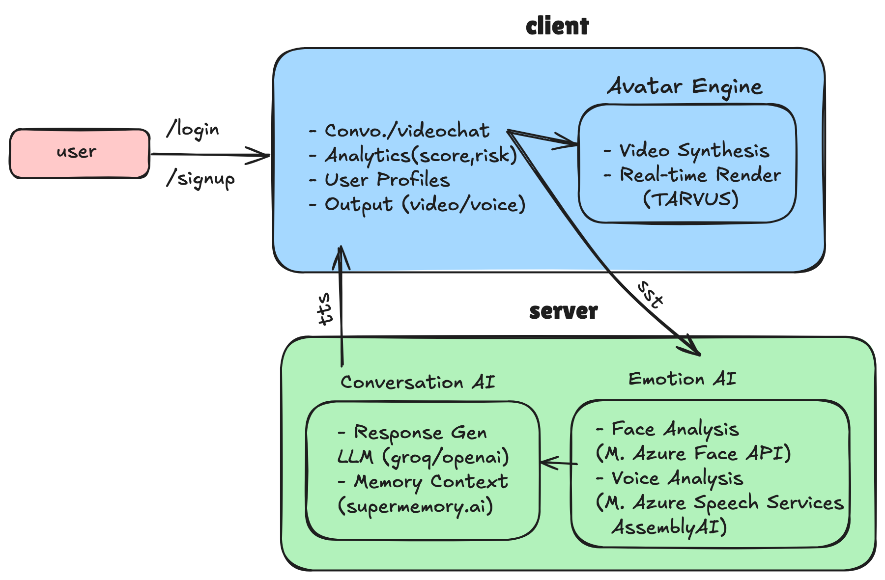

<h1>
  <span style="color:#27ae60;">mento.ai</span>: AI-Powered Teacher & Doubt Clarifier
</h1>

**Revolutionizing education with 24/7 personalized AI-powered video avatar teachers that provide real-time learning support, doubt clarification, and adaptive teaching through emotion and engagement recognition.**

[](https://opensource.org/licenses/MIT)
[](https://vitejs.dev/)
[](https://reactjs.org/)
[](https://www.typescriptlang.org/)

---


## 🎓 Project Overview

**mento.ai** is a cutting-edge AI-powered educational platform that provides 24/7 personalized learning support through intelligent video avatar teachers. By combining real-time engagement recognition, adaptive teaching algorithms, and lifelike educational avatars, mento.ai delivers personalized, interactive, and highly effective learning experiences—transforming how students learn and clarify doubts.

---

## 🚩 Problem Statement

- Over 1.2 billion students globally lack access to personalized, quality education and doubt clarification.
- 60% of students struggle with understanding concepts due to lack of individual attention and support.
- Existing educational AI tools are text-only, missing crucial engagement and learning pattern recognition.
- Teachers cannot provide 24/7 personalized support, leaving critical learning gaps and unanswered doubts.

---

## 💡 The mento.ai Solution

- **AI-Powered Teacher Avatars:** Intelligent video avatars that adapt teaching style, pace, and explanations based on student engagement and understanding.
- **Real-Time Doubt Clarification:** Instant, personalized explanations across all subjects with step-by-step problem-solving and concept reinforcement.
- **Engagement & Learning Recognition:** Advanced facial/vocal engagement detection (confusion, excitement, boredom) to adapt teaching approach.
- **Adaptive Learning Paths:** Personalized study roadmaps, progress tracking, and performance insights for optimal learning outcomes.

## 🛠️ Technical Stack

### Frontend
- **Framework**: React 18 with TypeScript
- **Build Tool**: Vite 4
- **Styling**: Tailwind CSS
- **State Management**: React Context API
- **Animation**: Framer Motion
- **Icons**: Lucide React
- **HTTP Client**: Axios

### Backend
- **Runtime**: Node.js
- **Framework**: Express.js
- **API Documentation**: OpenAPI/Swagger
- **Rate Limiting**: express-rate-limit
- **Security**: CORS, Environment-based configuration

### AI & Integrations
- **Avatar & Video**: Tavus API
- **Emotion Recognition**: Custom implementation (future)
- **Speech-to-Text**: Web Speech API (browser-native)

---

## 🏗️ System Architecture & Tech Stack

<p align="center">
  
</p>

**Frontend:** React.js, TypeScript, TailwindCSS, JavaScript  
**Backend:** Node.js, Express.js, Python (ML, APIs)  
**Databases:** MongoDB / PostgreSQL  
**Educational AI Services:**
- Engagement Analysis: Microsoft Azure Face API
- Voice Analysis: Microsoft Speech Services
- Speech Recognition (STT): Deepgram / Google STT
- Speech Synthesis (TTS): Eleven Labs TTS
- Teacher Avatar: Tavus
- Educational LLM: OpenAI GPT-4 / Claude
- Learning Analytics: Custom ML Models

---

## 🌍 Social Impact & Vision

- Directly addresses UN SDG 4 (Quality Education) by making personalized, quality education universally accessible and affordable.
- Bridging the education gap through intelligent, always-available AI teachers.
- Multi-modal learning analytics, adaptive curriculum, and predictive modeling for optimal learning outcomes.
- Scalable cloud infrastructure supporting millions of students worldwide.

---

## 📊 Market Validation & Competitive Advantage

- 1.2B+ students globally need personalized education support (UNESCO 2024).
- 85% of students struggle with doubt clarification and need 24/7 support (EdTech Report 2024).
- mento.ai is the only solution combining real-time engagement recognition, video teacher avatars, and educational expertise.
- Dual-mode: Tutor Mode (homework help) + Explainer Mode (interactive lessons).
- Adaptive learning with performance tracking and personalized recommendations.

---

## 🆚 Competitive Landscape

| Platform         | Engagement Recognition | Video Avatar | Educational AI | Doubt Clarification |
|------------------|----------------------|--------------|----------------|-------------------|
| **mento.ai**      | ✅                    | ✅            | ✅              | ✅                 |
| Khan Academy     | ❌                    | ❌            | ⚠️ (limited)    | ⚠️ (text only)     |
| Duolingo         | ❌                    | ❌            | ⚠️ (basic)      | ❌                 |
| Coursera         | ❌                    | ❌            | ⚠️ (static)     | ❌                 |
| Tavus/Synthesia  | ❌                    | ✅            | ❌              | ❌                 |

---

## 🚀 Quick Start

### Prerequisites
- Node.js 16+ and npm 8+
- Tavus API Key (get one from [Tavus](https://www.tavus.io/))

### Setup & Installation

1. **Clone the repository**
   ```bash
  git clone https://github.com/yourusername/mento.ai.git
  cd mento.ai
   ```

2. **Install dependencies**
   ```bash
   # Install frontend dependencies
   npm install
   
   # Install backend dependencies
   cd server
   npm i
   cd ..
   cd client
   npm i
   ```

3. **Configure environment variables**
   - Frontend: Create `.env` file in the root directory
     ```
     VITE_API_BASE_URL=http://localhost:3001/api
     VITE_TAVUS_REPLICA_ID=r6ae5b6efc9d
     VITE_ENABLE_TAVUS=true
     VITE_ENABLE_AUTH=false
     ```
   - Backend: Create `.env` file in the `backend` directory
     ```
     PORT=3001
     NODE_ENV=development
     TAVUS_API_KEY=your_tavus_api_key
     TAVUS_API_URL=https://tavusapi.com/v2
     TAVUS_REPLICA_ID=r6ae5b6efc9d
     ```

4. **Start the development servers**
   - In one terminal (backend):
     ```bash
     npm start
     ```
   - In another terminal (frontend):
     ```bash
     npm run dev
     ```

5. **Open the app**
   - Frontend: http://localhost:8080
   - Backend API: http://localhost:3001/api

---

## 🛠️ Usage

- Launch the app and interact with your AI teacher avatar for real-time, personalized learning support.
- Explore features like video tutoring, doubt clarification, progress tracking, and adaptive learning paths.

---

## 🤝 Contributing

We welcome contributions! Please open issues, submit pull requests, or join our discussions to help make mento.ai even better.

---

## 👥 Team: KANYARASHI

- **Surya Ganesh Yadala** (Full Stack Developer)
- **Sandeep Mopuri** (Backend Developer)
- **Dharma Teja Pola** (Product Builder & AI Developer)

*Winners @ World's Largest AI Hackathon - Raise Your Hack*
*Now revolutionizing education with AI-powered teaching*

---

## 📄 License

This project is licensed under the MIT License.

---

